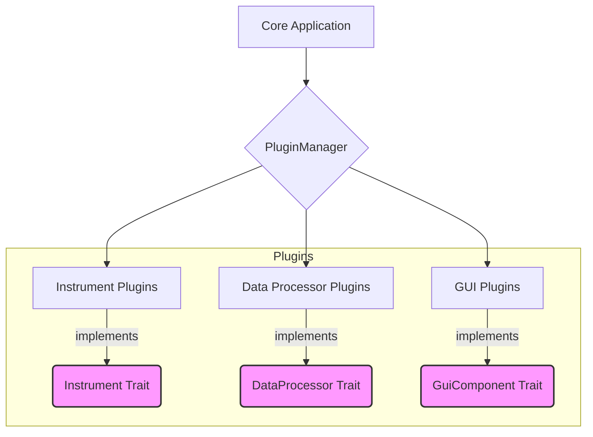
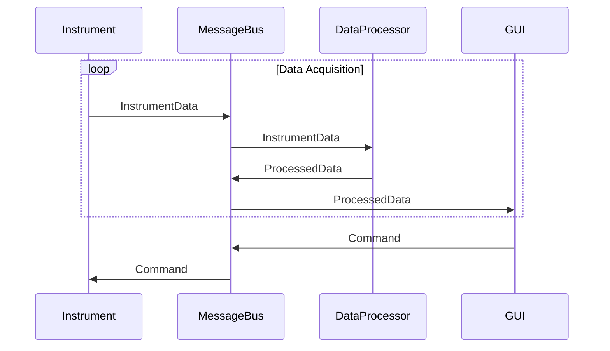

# System Architecture

This document outlines the architecture of the Rust DAQ application, covering key aspects such as the plugin system, data flow, asynchronous patterns, and GUI.

## Core Design Principles

The system is built on the following principles:

- **Modularity**: A plugin-based architecture allows for easy extension and maintenance.
- **Asynchronicity**: An async-first design ensures a responsive UI and efficient I/O.
- **Type Safety**: Leveraging Rust's strong type system to minimize runtime errors.

## Traits: Defining the Core Interfaces

The foundation of the application's modularity is a set of traits that define the contracts for various components.

```rust
// Core trait for all instrument plugins
pub trait Instrument: Send + Sync {
    type Config: serde::Serialize + serde::DeserializeOwned;
    type Data: Send + Clone;

    async fn initialize(&mut self, config: Self::Config) -> Result<(), InstrumentError>;
    async fn acquire_data(&mut self) -> Result<Self::Data, InstrumentError>;
    async fn configure(&mut self, config: Self::Config) -> Result<(), InstrumentError>;
    async fn shutdown(&mut self) -> Result<(), InstrumentError>;
}

// Trait for data processing modules
pub trait DataProcessor: Send + Sync {
    type Input: Send + Clone;
    type Output: Send + Clone;

    async fn process(&self, data: Self::Input) -> Result<Self::Output, ProcessError>;
}

// Trait for GUI components
pub trait GuiComponent: Send {
    fn update(&mut self, ctx: &egui::Context, frame: &mut eframe::Frame);
    fn handle_event(&mut self, event: GuiEvent);
}
```

## Plugin System

The application uses a plugin system to dynamically load instruments, data processors, and GUI components at runtime. This allows for a flexible and extensible architecture.

### Plugin Architecture Diagram



A `PluginManager` is responsible for loading, unloading, and managing the lifecycle of plugins.

```rust
pub struct PluginManager {
    instruments: HashMap<String, Box<dyn Instrument>>,
    processors: HashMap<String, Box<dyn DataProcessor>>,
    gui_components: HashMap<String, Box<dyn GuiComponent>>,
}

impl PluginManager {
    pub async fn load_plugin(&mut self, plugin_path: &str) -> Result<(), PluginError> {
        // Implementation for dynamic plugin loading
    }

    pub async fn unload_plugin(&mut self, plugin_name: &str) -> Result<(), PluginError> {
        // Implementation for plugin cleanup and removal
    }
}
```

## Async Patterns

The application is built on Tokio, an asynchronous runtime for Rust. This allows for high-performance, non-blocking I/O operations, which is crucial for instrument communication and a responsive GUI.

- **Actor-like Patterns**: Components communicate via channels, similar to the actor model. This decouples components and makes the system easier to reason about.
- **`tokio::select!`**: This macro is used to handle multiple asynchronous operations concurrently, for example, listening for GUI events and instrument data simultaneously.

## Instrument Drivers

Instrument drivers are the concrete implementations of the `Instrument` trait. Each driver is responsible for communicating with a specific piece of hardware.

- **Configuration**: Each driver has a specific configuration struct, which is serialized/deserialized to/from a configuration file.
- **Error Handling**: Instrument-specific errors are handled within the driver and propagated as `InstrumentError`.

## GUI

The Graphical User Interface is built using `egui`, a pure-Rust immediate mode GUI library.

- **State Management**: The GUI is composed of several `GuiComponent`s, each managing its own state.
- **Event Handling**: GUI events are handled in the `handle_event` method of each component, which can then dispatch `SystemMessage`s to the rest of the application.

## Data Flow

Communication between components is handled by a message-based system, ensuring loose coupling and clear data pathways.

### Data Flow Diagram



### Message-Based Communication

A central `MessageBus` facilitates communication using channels. System messages can represent data, configuration updates, commands, or errors.

```rust
#[derive(Debug, Clone)]
pub enum SystemMessage {
    InstrumentData { source: String, data: Vec<u8>, timestamp: std::time::Instant },
    ConfigUpdate { target: String, config: serde_json::Value },
    Command { target: String, command: String, params: Vec<String> },
    Error { source: String, error: String },
}

pub struct MessageBus {
    sender: mpsc::UnboundedSender<SystemMessage>,
    receiver: mpsc::UnboundedReceiver<SystemMessage>,
    subscribers: HashMap<String, Vec<mpsc::UnboundedSender<SystemMessage>>>,
}
```

### Data Pipeline

Data from instruments can be piped through a series of processing stages.

```rust
pub struct DataPipeline {
    stages: Vec<Box<dyn DataProcessor>>,
    input: mpsc::Receiver<RawData>,
    output: mpsc::Sender<ProcessedData>,
}

impl DataPipeline {
    pub async fn process_stream(&mut self) {
        while let Some(data) = self.input.recv().await {
            let mut current_data = data;
            for stage in &self.stages {
                current_data = stage.process(current_data).await.unwrap(); // Simplified for clarity
            }
            self.output.send(current_data).await.unwrap();
        }
    }
}
```