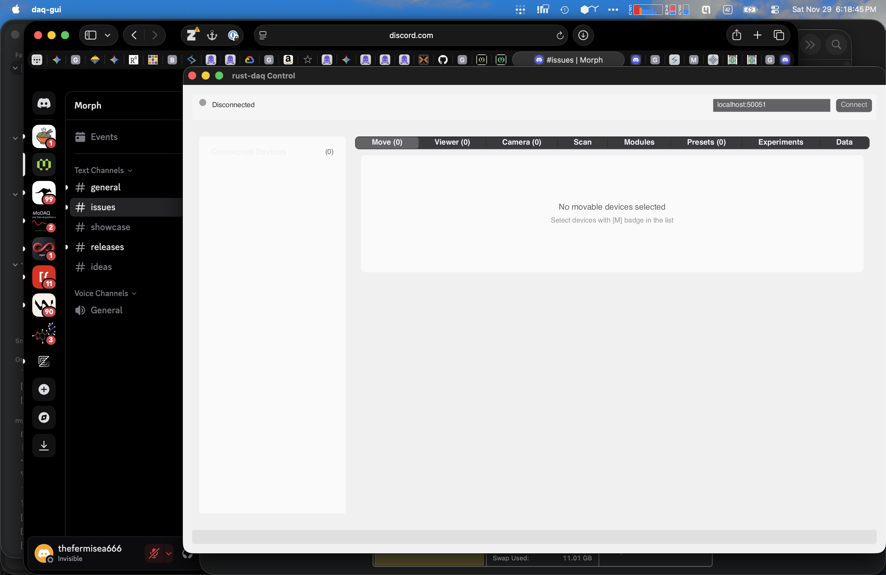

# rust-daq

A high-performance, headless-first data acquisition (DAQ) system written in Rust, designed for scientific and industrial applications.



## Features

- **Headless-First Architecture**: Core daemon runs independently of any UI
- **Capability-Based Hardware Abstraction**: Composable traits for motion, sensing, triggering, and camera control
- **YAML Plugin System**: Define new instruments without writing code
- **Tauri GUI**: Modern, cross-platform desktop interface (React + Tauri) connecting via gRPC
- **High-Performance Data Pipeline**: Memory-mapped ring buffers with Arrow IPC and HDF5 persistence
- **Script-Driven Automation**: Rhai scripting for experiment control
- **Remote Control**: Full gRPC API for network-transparent operation

## Architecture

```
┌─────────────────────────────────────────────────────────────────┐
│                      GUI (Tauri + React)                        │
│  ┌─────────┐ ┌─────────┐ ┌─────────┐ ┌─────────┐ ┌─────────┐   │
│  │  Move   │ │ Camera  │ │  Scan   │ │ Modules │ │  Data   │   │
│  └────┬────┘ └────┬────┘ └────┬────┘ └────┬────┘ └────┬────┘   │
└───────┼──────────┼─────────┼─────────┼───────────┼──────────────┘
        │          │         │         │           │
        └──────────┴─────────┴─────────┴───────────┘
                             │ gRPC
┌────────────────────────────┴────────────────────────────────────┐
│                        DAQ Daemon                                │
│  ┌──────────────┐  ┌──────────────┐  ┌──────────────┐           │
│  │   Hardware   │  │    Plugin    │  │   Storage    │           │
│  │   Registry   │  │   Factory    │  │   Service    │           │
│  └──────┬───────┘  └──────┬───────┘  └──────┬───────┘           │
│         │                 │                 │                    │
│  ┌──────┴─────────────────┴─────────────────┴──────┐            │
│  │              Capability Traits                   │            │
│  │  Movable │ Readable │ Triggerable │ FrameProducer │           │
│  └──────────────────────────────────────────────────┘            │
└──────────────────────────────────────────────────────────────────┘
        │
        ▼
┌──────────────────────────────────────────────────────────────────┐
│                         Hardware                                  │
│  ┌─────────┐ ┌─────────┐ ┌─────────┐ ┌─────────┐ ┌─────────┐    │
│  │ ELL14   │ │ ESP300  │ │ MaiTai  │ │ PVCAM   │ │ Plugin  │    │
│  │(Thorlab)│ │(Newport)│ │ (Laser) │ │(Camera) │ │ Drivers │    │
│  └─────────┘ └─────────┘ └─────────┘ └─────────┘ └─────────┘    │
└──────────────────────────────────────────────────────────────────┘
```

## Quick Start

### Build

```bash
# Build with default features
cargo build

# Build with all features (all storage backends and hardware drivers)
cargo build --all-features

# Build the Tauri GUI (in gui-tauri directory)
cd gui-tauri && npm install && npm run tauri build
```

### Run

```bash
# Start the daemon
cargo run -- daemon --port 50051

# Run a Rhai script
cargo run -- run examples/simple_scan.rhai

# Launch the Tauri GUI (in gui-tauri directory)
cd gui-tauri && npm run tauri dev
```

### Test

```bash
# Run all tests (122 passing)
cargo test

# Run specific test suite
cargo test --test plugin_system_integration
```

## Capability Traits

Hardware devices implement composable capability traits:

| Trait | Description | Example Devices |
|-------|-------------|-----------------|
| `Movable` | Position control | Stages, rotation mounts |
| `Readable` | Scalar measurements | Power meters, temperature sensors |
| `Settable` | Parameter adjustment | Setpoint controls |
| `Switchable` | On/off control | Shutters, heaters |
| `Triggerable` | External triggering | Cameras, pulse generators |
| `ExposureControl` | Camera exposure | Scientific cameras |
| `FrameProducer` | Image acquisition | PVCAM cameras |
| `Actionable` | One-shot commands | Home, calibrate |
| `Loggable` | Continuous logging | Any readable device |

## Hardware Drivers

### Native Drivers

| Driver | Device | Capabilities |
|--------|--------|--------------|
| `ell14` | Thorlabs Elliptec | Movable |
| `esp300` | Newport ESP300 | Movable |
| `maitai` | Spectra-Physics MaiTai | Readable, Settable |
| `pvcam` | Photometrics Cameras | FrameProducer, ExposureControl, Triggerable |
| `newport_1830c` | Newport 1830-C | Readable |

### Plugin System

Define new instruments with YAML:

```yaml
# plugins/my-device.yaml
metadata:
  id: "my-device"
  name: "My Custom Device"
  version: "1.0.0"
  driver_type: "serial_scpi"

protocol:
  baud_rate: 9600
  termination: "\r\n"

capabilities:
  readable:
    - name: "temperature"
      command: "TEMP?"
      unit: "C"
  movable:
    axes:
      - name: "x"
        unit: "mm"
        min: 0.0
        max: 100.0
    set_cmd: "POS:{axis} {val}"
    get_cmd: "POS:{axis}?"
```

## Data Pipeline ("The Mullet Strategy")

- **Party in front**: Memory-mapped ring buffer for high-throughput Arrow IPC writes (10k+ writes/sec)
- **Business in back**: Background HDF5 writer for Python/MATLAB/Igor compatibility (1 Hz flush)

```rust
// Data flows: Hardware → Ring Buffer → HDF5
let ring = RingBuffer::create("/dev/shm/daq_data", capacity)?;
ring.write(&measurements)?;  // Fast, non-blocking

// Background writer handles persistence
let writer = HDF5Writer::new(ring, output_path)?;
writer.start_background_flush(Duration::from_secs(1));
```

## gRPC Services

| Service | Description |
|---------|-------------|
| `HardwareService` | Device discovery, motion control, value streaming |
| `ScanService` | Coordinated multi-axis scanning |
| `ModuleService` | Module lifecycle and configuration |
| `PresetService` | Hardware state presets |
| `StorageService` | Recording control and data export |
| `PluginService` | Dynamic plugin loading and spawning |
| `RunEngineService` | Plan queue execution (experimental) |

## GUI Panels

The Tauri-based GUI provides:

- **Move Panel**: Control movable devices with position display
- **Viewer Panel**: Real-time value monitoring
- **Camera Panel**: Frame preview and exposure control
- **Scan Panel**: Configure and execute multi-axis scans
- **Modules Panel**: Create, configure, and monitor modules
- **Presets Panel**: Save and load hardware configurations
- **Experiments Panel**: Queue and execute plans
- **Data Panel**: Recording status and export

## Documentation

- [Architecture Overview](./docs/architecture/)
- [CLI Guide](./docs/guides/cli_guide.md)
- [PVCAM Operator Guide](./docs/instruments/PVCAM_OPERATOR_GUIDE.md)
- [Morph Integration](./docs/MORPH_INTEGRATION.md)

## Project Status

**Build**: ✅ Passing  
**Tests**: ✅ 122 passing  
**Architecture**: V5 Headless-First (stable)

### Known Issues

- Frame streaming in plugin system defaults to mock mode (bd-fsx5)
- Some plugin handles require explicit mock flag (bd-dks4)

## License

[License information here]
