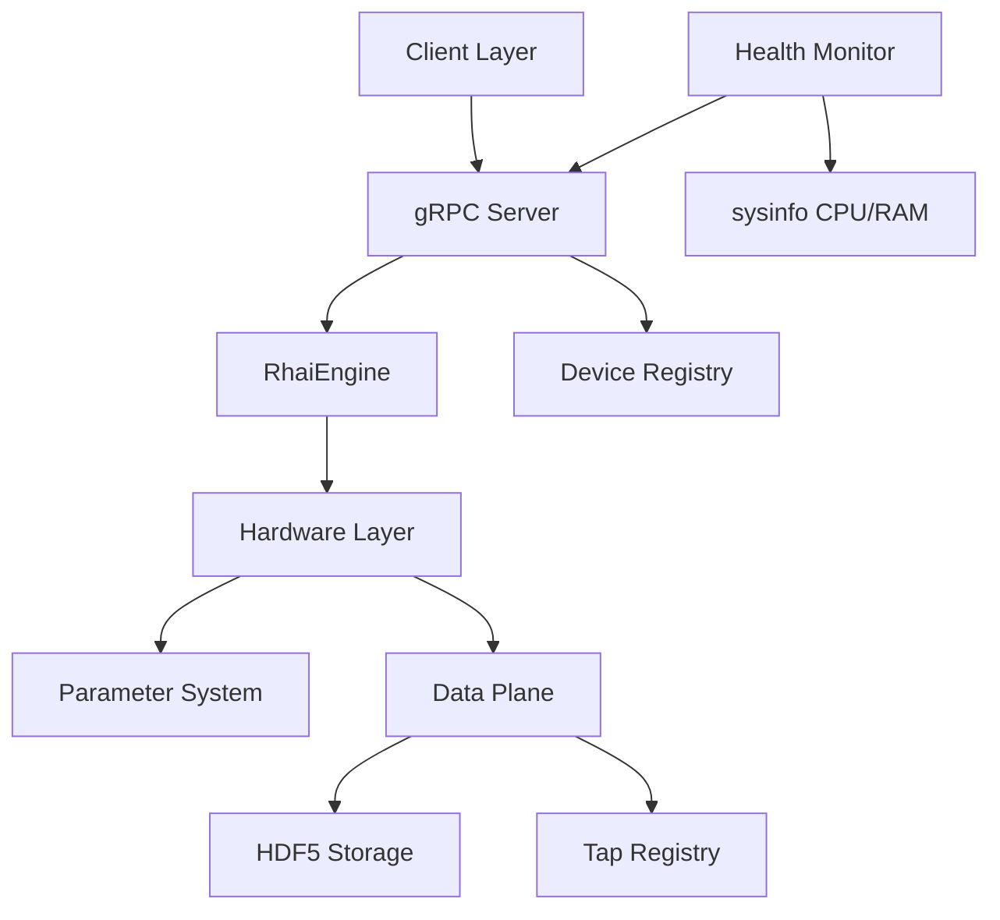

# V5 Implementation Status

**Last Updated**: 2024-12-25
**Status**: ✅ Phase 2 COMPLETE - gRPC Streaming Implemented

## Executive Summary

The V5 architecture is **functionally complete**. All critical infrastructure (Parameter<T> system, driver migration, gRPC services, health monitoring) is operational.

**Phase 2 Complete (2024-12-25)**:

- gRPC Streaming implementation verified for high-performance camera data.
- Prime BSI metadata and parameters fully exposed via gRPC.
- `ExposureControl` and `Roi` capabilities verified via integration tests.
- *Note*: Hardware verification on `maitai` is pending physical reset of the camera.

---

## Completed Features (as of 2025-12-10)

### Core Architecture

- ✅ **Reactive Parameter System** (bd-bkjy)
  - `Parameter<T>` with async hardware callbacks via `BoxFuture<'static, Result<()>>`
  - `Observable<T>` base primitive with watch channel notifications
  - Composition pattern: Parameter composes Observable internally
  - Located: `crates/daq-core/src/parameter.rs`, `crates/daq-core/src/observable.rs`

- ✅ **Parameterized Trait** (bd-9clg)
  - Central parameter registry pattern
  - 9 implementations across driver files
  - Enables gRPC parameter enumeration and preset snapshots

- ✅ **Proto Extraction** (bd-37tw.4)
  - Proto files in `crates/daq-proto/proto/`
  - Domain↔proto conversions in `crates/daq-proto/src/convert.rs`
  - Module types decoupled from networking (bd-37tw.6)

### Hardware Layer

- ✅ **Driver Migration to Parameters** (bd-l0a2)
  - All major drivers use `Parameter<T>` for reactive state:
    - `ELL14` - Thorlabs rotation mount
    - `ESP300` - Newport motion controller  
    - `PVCAM` - Photometrics cameras
    - `MaiTai` - Spectra-Physics laser
    - `Newport1830C` - Power meter
  - Mock drivers follow V5 pattern (MockCamera, MockStage)
  - Located: `crates/rust-daq/src/hardware/` (being extracted to `crates/daq-hardware/`)

- ✅ **Capability Traits** (bd-oq51)
  - `Movable` - Position control
  - `Readable` - Scalar measurements
  - `Triggerable` - Camera triggering
  - `FrameProducer` - Image acquisition
  - `ExposureControl` - Camera exposure
  - `Parameterized` - Parameter tree exposure
  - Located: `crates/daq-hardware/src/capabilities.rs`

### gRPC Services

- ✅ **Module Compilation Fixed** (bd-gmwv)
  - Feature-gated with `#[cfg(feature = "networking")]`
  - Health service with real system metrics
  - Located: `crates/rust-daq/src/grpc/`

- ✅ **Proto Types Extracted** (bd-37tw.4)
  - Proto definitions: `crates/daq-proto/proto/daq.proto`
  - Re-exported via `crates/rust-daq/src/grpc/mod.rs`

- ✅ **Parameter Tree Exposure** (bd-chje)
  - Parameters accessible via gRPC RPCs
  - Device registry integration

- ✅ **Storage Service with Async I/O** (bd-081j)
  - `tokio::fs` throughout (no blocking std::fs)
  - Async disk space checking

- ✅ **gRPC Frame Streaming** (bd-3pdi)
  - High-performance `u16` frame streaming for Prime BSI
  - `ExposureControl` and `Roi` gRPC integration
  - Metadata propagation (timestamps, sequence numbers)

### Monitoring

- ✅ **Health Monitoring System** (bd-ergo, bd-3ti1)
  - `SystemMetricsCollector` for CPU/RAM via `sysinfo` crate
  - Device registry heartbeats
  - Dual gRPC health services
  - Located: `crates/rust-daq/src/health/`

### Data Pipeline

- ✅ **Tap Registry** (bd-s4z3)
  - Dynamic tap management for live data streams
  - Backpressure handling
  - Located: `crates/rust-daq/src/data/`

- ✅ **Ring Buffer** (bd-q2we)
  - Lock-free atomic operations
  - Memory-mapped for cross-process access
  - Located: `crates/rust-daq/src/data/ring_buffer.rs`

- ✅ **HDF5 Writer** (bd-wmq2)
  - Background Arrow→HDF5 translation
  - Non-blocking flush
  - Located: `crates/rust-daq/src/data/hdf5_writer.rs`

### Configuration

- ✅ **Config Type Refactoring** (bd-ou6y.7)
  - `InstrumentConfig` (was `InstrumentConfigV3`)
  - Backward compatible type aliases
  - Async I/O throughout config loading

### Scripting

- ✅ **RhaiEngine** (bd-pabc)
  - Primary scripting interface
  - 10,000 operation safety limit
  - Located: `crates/rust-daq/src/scripting/rhai_engine.rs`

- ✅ **ScriptHost Deprecated**
  - Legacy V4 wrapper retained for compatibility
  - All new code should use RhaiEngine
  - Located: `crates/rust-daq/src/scripting/engine.rs` (deprecated)

---

## Current Codebase State

### Workspace Crate Structure

```
crates/
├── daq-core/        # Domain types, parameters, observables
├── daq-proto/       # Proto definitions and conversions
├── daq-hardware/    # Hardware drivers (in progress - Phase 3)
├── rust-daq/        # Runtime façade, gRPC, GUI, scripting
└── daq-bin/         # CLI entrypoints
```

### Files Using Parameter<T>

```
crates/rust-daq/src/hardware/maitai.rs
crates/rust-daq/src/hardware/newport_1830c.rs
crates/rust-daq/src/hardware/pvcam.rs
crates/rust-daq/src/hardware/esp300.rs
crates/rust-daq/src/hardware/ell14.rs
crates/rust-daq/src/hardware/mock.rs
```

### Files Implementing Parameterized Trait

9 total implementations across driver files

### Remaining Arc<RwLock Usage (Intentional)

```
crates/rust-daq/src/hardware/mock.rs        - Internal frame buffer (not exposed)
crates/rust-daq/src/hardware/registry.rs    - Device registry collection
```

These are architectural choices, not Split Brain violations.

---

## Architecture Diagram



---

## Remaining Work (TODOs)

### P2: Documentation & Examples

- [x] ~~Update all examples to use `Parameter<T>` pattern~~ - **DONE**: PVCAM fully migrated
- [ ] **TODO**: Create developer guide for implementing new drivers
  - Location: `docs/guides/driver_development.md`
  - Should cover: Parameterized trait, capability traits, BoxFuture pattern
  
- [x] ~~Document Parameterized trait implementation pattern~~ - **DONE**: See PVCAM docs
  
- [x] ~~Consolidate V5 documentation~~ - **DONE**: Merged overlapping content, archived historical docs

### P2: Advanced Features

- [ ] **bd-dqic**: Ring buffer tap mechanism for live data visualization
  - Secondary consumers without disrupting HDF5 writer
  - Enables headless mode with remote preview
  
- [ ] **bd-ej44**: Automatic experiment manifest injection to HDF5
  - Snapshot all parameters at experiment start
  - Required for experiment reproducibility
  
- [ ] **bd-pauy**: Enhanced health monitoring alerts
  - Threshold-based alerting
  - Integration with external monitoring systems

### P3: Performance Optimization

- [ ] **TODO**: Profile lock contention under 10 kHz load
  - Focus on tokio::sync::Mutex in hot paths
  
- [ ] **TODO**: Consider priority queues for critical operations
  - Emergency stop should preempt normal commands
  
- [ ] **TODO**: Benchmark Parameter<T> overhead vs raw state access
  - Quantify cost of reactive pattern

### P3: Testing Gaps

- [ ] **TODO**: Add integration tests for gRPC parameter streaming
- [ ] **TODO**: Hardware-in-the-loop tests for all V5 drivers
- [ ] **TODO**: Performance regression tests

---

## Intended Architecture (Target State)

The V5 architecture targets these capabilities:

### Fully Reactive State

All hardware state flows through `Parameter<T>`:

```rust
// Driver exposes parameters
impl Parameterized for MyDriver {
    fn parameters(&self) -> &ParameterSet { &self.params }
}

// gRPC client subscribes to changes
async fn stream_parameters(device: &dyn Parameterized) {
    for param in device.parameters().iter() {
        let rx = param.subscribe();
        // Real-time updates flow automatically
    }
}
```

### Zero-Copy Data Pipeline

```
Hardware Frame → Ring Buffer (mmap) → HDF5 Writer (background)
                      ↓
              Python/Julia Reader (pyarrow)
```

### Crash-Resilient Topology

```
[Daemon] ←gRPC→ [GUI Client]
    ↓
[Hardware]

GUI crash → Daemon continues → Experiment unaffected
```

---

## Migration Guide

### From ScriptHost to RhaiEngine

```rust
// OLD (deprecated)
let host = ScriptHost::new();
host.execute(script)?;

// NEW
let engine = RhaiEngine::new();
engine.run(script)?;
```

### From Arc<RwLock> to Parameter<T>

See `docs/architecture/ADR_005_REACTIVE_PARAMETERS.md` for detailed migration pattern.

---

## Version History

| Date | Change | Issues |
|------|--------|--------|
| 2025-12-06 | V5 core complete | bd-gcjl, bd-l0a2, bd-gmwv |
| 2025-12-05 | Driver migration | bd-dili |
| 2025-12-04 | Parameter/Observable unification | bd-si19, bd-9clg |
| 2025-12-02 | Split Brain analysis | bd-gcjl |

---

## Related Documents

- `V5_ARCHITECTURE.md` - Complete architectural documentation
- `V5_CRITICAL_PATH.md` - Historical critical path (now RESOLVED)
- `ADR_005_REACTIVE_PARAMETERS.md` - Design decisions for Parameter<T>
- `CLAUDE.md` - Project context and build instructions
