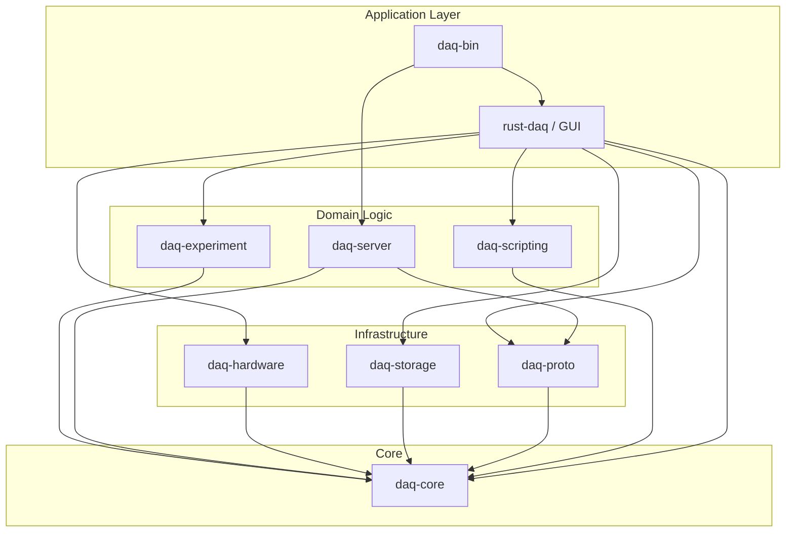
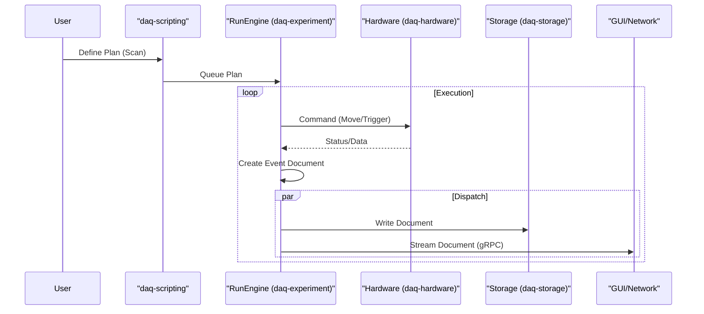
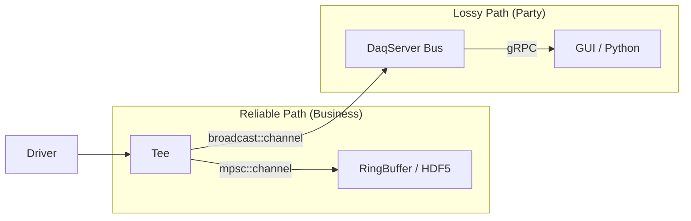

# Rust DAQ Architecture Analysis

## Overview

`rust-daq` is a modular, high-performance data acquisition system built in Rust. It follows a workspace-based architecture with a clear separation of concerns between core types, hardware abstraction, experiment orchestration, storage, and network interfaces.

## Crate Hierarchy & Responsibilities

The project is structured as a Cargo workspace with the following key components:

### Core & Infrastructure
- **`daq-core`**: The foundation of the system. Defines common types, traits, capabilities, and data structures used across all other crates. It acts as the "common language" of the ecosystem.
- **`daq-proto`**: Defines the wire protocols (gRPC/Protobuf) for network communication. Dependencies on `tonic` and `prost`.
- **`daq-bin`**: The application entry point. Contains the main binary (`rust_daq`) and acts as the composition root, wiring together the other crates based on compile-time features.

### Functionality Modules
- **`daq-hardware`**: Implements the hardware abstraction layer (HAL). It uses a **capability-based** model where devices expose capabilities (e.g., `Move`, `Detect`) rather than concrete types. Contains drivers for specific hardware (Thorlabs, Newport, PVCAM, etc.) managed via feature flags.
- **`daq-experiment`**: The orchestration engine. Implements a **RunEngine** inspired by the Bluesky library. It executes declarative **Plans** and generates a stream of **Documents** (Start, Descriptor, Event, Stop).
- **`daq-storage`**: Handles data persistence. Supports multiple backends including CSV, HDF5, and Arrow, abstracting the physical storage format from the experiment logic.
- **`daq-scripting`**: Provides scripting capabilities (Python, Rhai) to allow users to define experiments and control hardware dynamically.
- **`daq-server`**: Exposes the system functionality over the network using gRPC (`tonic`). Supports web clients via `tonic-web`.

### The Integrator
- **`rust-daq`**: The "glue" library. It integrates the core modules and provides high-level application logic. It currently also houses the GUI code (`egui`), making it a heavy dependency.

## Architecture Diagrams

### High-Level Dependency Graph

### Data Flow: Experiment Execution

The system follows a pipeline architecture for experiment data:

1.  **Plan**: A user or script submits a declarative plan (e.g., "Scan X from 0 to 10").
2.  **RunEngine**: The `daq-experiment` engine accepts the plan.
3.  **Hardware**: The engine commands devices via `daq-hardware`.
4.  **Documents**: As data is acquired, the engine emits a stream of structured **Documents**.
5.  **Dispatch**: Documents are sent to storage (local/remote) and the network (for live visualization).

## Key Architectural Patterns

1.  **Capability-Based HAL**: Hardware is not represented by inheritance hierarchies but by what it *can do* (Capabilities). This allows for flexible composition and easier mocking.
2.  **Bluesky-like Orchestration**: Separation of *what* to do (Plan) from *how* to do it (RunEngine). This enables features like pause/resume, error recovery, and complex scanning logic without tightly coupling to specific hardware.
3.  **Document-Oriented Data Model**: Data is treated as a stream of self-describing documents (Start -> Descriptor -> Events... -> Stop). This schema-less approach adapts well to varied experiments.
4.  **Workspace Composition**: Usage of Cargo workspace to enforce modularity, though `rust-daq` remains a large central integrator.

## Data Pipeline Architecture (The Mullet Strategy)

To resolve the conflict between high-throughput reliable storage and low-latency live visualization, the system implements a **Tee-based Pipeline**:

### Components
1.  **MeasurementSource**: Drivers (e.g., `PvcamDriver`) produce `Arc<Frame>` or `Measurement` data.
2.  **Tee**: A processor that splits the stream into two paths:
    *   **Reliable Path**: Uses bounded `mpsc` channels with **backpressure**. If the storage writer lags, the driver is blocked/slowed to prevent data loss.
    *   **Lossy Path**: Uses `broadcast` channels. If consumers (GUI, Network) lag, they miss frames (`RecvError::Lagged`), but the pipeline continues at full speed.
3.  **Storage Sink**: A dedicated task consuming the Reliable Path and writing to the memory-mapped `RingBuffer`.
4.  **Live View**: The `DaqServer` subscribes to the Lossy Path and streams data to gRPC clients.

## Code Smells & Recommendations

### ✅ RESOLVED: The `rust-daq` Monolith (bd-232k Refactoring)

**Previous Smell**: The `rust-daq` crate acted as both a library integrator and the home for implementation code and GUI, making it a very heavy dependency.

**Resolution (bd-232k Epic - Dec 2025)**:
- GUI was already separated into `daq-egui` crate
- Removed 6,877 lines of dead implementation code (data/, metadata.rs, session.rs, measurement/, procedures/, gui_main.rs)
- Transformed `rust-daq` into a thin **integration layer** with:
  - `prelude` module for organized re-exports
  - Feature-gated optional dependencies (daq-server, daq-scripting)
  - No implementation code (pure facade pattern)
- Root re-exports deprecated (removal in 0.6.0)
- Documentation: Users should import directly from focused crates or use `rust_daq::prelude::*`

**Status**: `rust-daq` is now a clean integration layer as originally recommended.

### ⚠️ PARTIALLY ADDRESSED: Feature Flag Duplication

**Smell**: Hardware support features are defined in `daq-hardware` and mirrored/re-exported in `rust-daq` and `daq-server`. This requires keeping `Cargo.toml` files in sync and adds maintenance burden.

**Progress**:
- Made `daq-server` and `daq-scripting` optional dependencies with explicit feature flags
- Created high-level feature profiles (`backend`, `frontend`, `cli`, `full`) to simplify common configurations
- Reduced duplication by having profiles aggregate lower-level features

**Remaining Work**:
- Hardware features still mirrored between crates
- Consider workspace-level feature management tool
- Evaluate if consumers should depend on `daq-hardware` directly for specific drivers

### ✅ BY DESIGN: Hub-and-Spoke Dependency

**Observation**: `daq-core` is a critical dependency. Any change in `daq-core` triggers a full rebuild of the ecosystem.

**Status**: This is intentional and working as designed.
- `daq-core` provides common types, traits, and abstractions
- Kept minimal and stable (Parameter, Observable, capabilities, error types)
- Experimental types are developed in leaf crates before promotion to core
- This pattern is standard in Rust ecosystems (tokio-core, serde-core, etc.)

**Recommendation**: Continue keeping `daq-core` minimal and stable. No action needed.

### ⚠️ PARTIALLY ADDRESSED: "Kitchen Sink" Integration

**Previous Smell**: `daq-bin` depends on `rust-daq` which pulls in almost everything. This makes the `rust_daq` binary heavy.

**Progress**:
- Created high-level feature profiles to control what gets compiled:
  - `backend` - Server, modules, hardware, CSV storage
  - `frontend` - GUI (egui) + networking
  - `cli` - Hardware, CSV storage, Python scripting
  - `full` - Most features (excludes HDF5 requiring native libs)
- Made `daq-server` and `daq-scripting` optional to reduce default binary size

**Remaining Work**:
- Create truly specialized binaries (e.g., `daq-cli`, `daq-server-bin`, `daq-gui-bin`) that only pull in what they need
- Consider whether `daq-bin` should continue to exist or be replaced by specialized entry points
