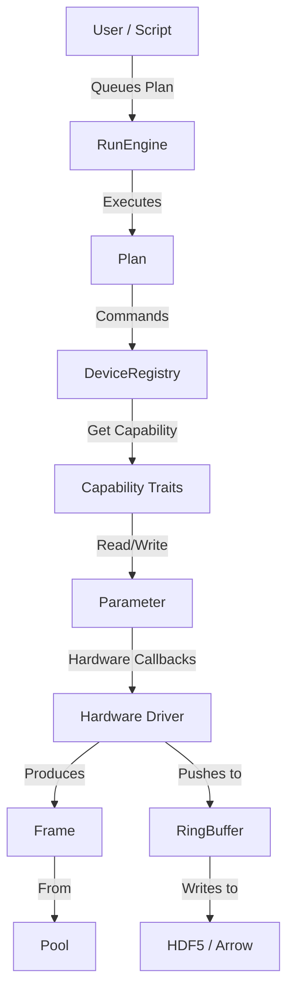

# rust-daq Architecture Guide for Newcomers

Welcome to the `rust-daq` codebase! This guide bridges the gap between high-level concepts and implementation details, helping you understand how the system fits together.

**Estimated Reading Time:** 20-30 minutes

---

## 1. Concept Dependency Map

To understand the system, follow the flow of data (bottom-up) and control (top-down):



### Learning Order
1. **Capabilities** (`daq-core`): The atomic building blocks of hardware support.
2. **Parameters** (`daq-core`): How state is managed and synchronized.
3. **Drivers** (`daq-hardware`): How concrete hardware implements capabilities.
4. **Frame Pipeline** (`daq-pool`, `daq-storage`): How high-speed data moves efficiently.
5. **Orchestration** (`daq-experiment`): How experiments are defined and executed.

---

## 2. Core Capability Traits

In `rust-daq`, a "Device" is not a monolithic struct. Instead, devices implement **Capability Traits**. This allows the system to treat a camera, a spectrometer, and a DAQ card uniformly based on what they *do*, not what they *are*.

**Location:** `crates/daq-core/src/capabilities.rs`

### Key Traits

| Trait | Function | Example Device |
|-------|----------|----------------|
| `Movable` | Can move to a position (`move_abs`, `home`) | Motor stage, Piezo rotator |
| `Readable` | Can produce a scalar reading (`read`) | Power meter, Thermocouple |
| `Triggerable` | Can be armed and triggered | Camera, Pulsed laser |
| `FrameProducer` | Generates 2D image data | PVCAM Camera, Simulator |
| `ExposureControl` | Has adjustable exposure time | Camera, Spectrometer |
| `WavelengthTunable` | Can change emission wavelength | Tunable Laser (MaiTai) |

### When to Implement What?
- If your device just reads a value: Implement `Readable`.
- If it moves (even logically, like a voltage): Implement `Movable`.
- If it takes pictures: Implement `Triggerable` + `FrameProducer` + `ExposureControl`.

**Pro Tip:** Don't create a `MySpecificCamera` trait. Combine existing traits.

---

## 3. Driver/Factory Pattern

Hardware drivers are loaded dynamically at runtime based on configuration. This decoupling allows the core system to remain unaware of specific hardware libraries.

**Location:** `crates/daq-hardware/src/registry.rs`

### The Device Registry
The `DeviceRegistry` is the central "phone book" for hardware. It holds thread-safe references (`Arc<Device>`) to all active devices.

```rust
// Generic usage
let registry = DeviceRegistry::new();
// Get any device that can move
let stage = registry.get_movable("stage_x")?; 
stage.move_abs(10.0).await?;
```

### The Driver Factory
When the application starts, it reads a TOML config file. The `DriverFactory` uses this config to instantiate the correct driver.

```toml
# config.toml
[[devices]]
id = "cam_1"
driver = "Pvcam"
name = "Prime BSI"
```

If you add a new hardware driver, you must register it in the `DriverFactory` enum so it can be instantiated from config.

---

## 4. Parameter System

Managing instrument state (exposure time, position, temperature) is complex. The `Parameter<T>` type handles synchronization between:
1. **Hardware**: The actual device state.
2. **GUI**: User interface widgets (Sliders, ComboBoxes).
3. **Storage**: Recording values when they change.

**Location:** `crates/daq-core/src/parameter.rs`

### Architecture
`Parameter<T>` is built on top of `Observable<T>`, which uses `tokio::sync::watch` for efficient broadcast of updates.

**Data Flow:**
1. User calls `param.set(value)`.
2. **Validation**: Range checks, NaN checks.
3. **Hardware Write**: Async callback writes to device.
4. **Update**: Internal value updates.
5. **Notify**: GUI widgets redraw; change listeners fire.

### Example Usage
```rust
let mut exposure = Parameter::new("exposure", 10.0)
    .with_unit("ms")
    .with_range_introspectable(1.0, 1000.0); // Hints for GUI Slider

// Connect hardware logic
exposure.connect_to_hardware_write(|val| Box::pin(async move {
    camera_driver.set_exposure_ms(val).await
}));
```

---

## 5. Frame Pipeline (Zero-Copy)

For high-speed cameras (100+ FPS), allocating a new `Vec<u8>` for every frame is too slow. `rust-daq` uses a rigorous zero-copy pipeline.

**Locations:** 
- `crates/daq-pool/src/lib.rs`
- `crates/daq-storage/src/ring_buffer.rs`

### The Pool
We use a lock-free `Pool<T>` pattern. Buffers are pre-allocated at startup.
- **Acquire**: Driver gets a `Loaned<Frame>` from the pool (no allocation).
- **Fill**: Driver writes pixel data directly into the buffer.
- **Pass**: Driver sends the `Loaned<Frame>` through a channel.
- **Return**: When the last receiver drops the frame, it automatically returns to the pool.

### The Ring Buffer
For persistent storage, frames are written to a memory-mapped `RingBuffer`. This allows:
- **Zero-copy writes**: Data is copied once from driver to shared memory.
- **Cross-process access**: Python or Julia scripts can read live data from the ring buffer file (`/dev/shm/ring.buf`) without slowing down the Rust acquisition loop.

---

## 6. Plan/RunEngine Orchestration

Experiments are defined declaratively as **Plans**. The **RunEngine** executes these plans. This separates *what* to do from *how* to do it.

**Location:** `crates/daq-experiment/src`

### Plans
A `Plan` is a generator that yields `PlanCommand`s.
- `MoveTo(device, position)`
- `Trigger(device)`
- `Checkpoint` (Safe to pause here)
- `EmitEvent` (Save data)

Examples: `Count`, `LineScan`, `GridScan`.

### The RunEngine
The engine runs the plan commands. It manages the state machine:
- **Idle**: Waiting for work.
- **Running**: Executing commands.
- **Paused**: Stopped at a checkpoint (user can resume or abort).

### The Document Model
Inspired by Bluesky, the engine emits a stream of documents describing the experiment:
1. **StartDoc**: Metadata, plan arguments.
2. **DescriptorDoc**: Schema of the data streams.
3. **EventDoc**: The actual data points.
4. **StopDoc**: Success/failure status.

This structured stream makes data analysis consistent regardless of the experiment type.

---

## 7. Extension Points

How do you add new functionality?

### Adding a New Driver
1. Create a struct in `crates/daq-driver-<name>`.
2. Implement capability traits (`Movable`, `Readable`, etc.).
3. Add a variant to `DriverType` in `daq-hardware`.
4. Add instantiation logic in `DriverFactory`.

### Adding a New Storage Backend
1. Create a struct implementing `DocumentConsumer`.
2. Handle `EventDoc`s to write data.
3. Register in `daq-server/src/grpc/storage_service.rs`.

### Adding a New Script Command
1. Edit `crates/daq-scripting/src/lib.rs`.
2. Register the function in the `Rhai` engine.
3. Use the `RunEngine` or `DeviceRegistry` to implement the logic.

---

## Further Reading

- **Crate Docs**: Run `cargo doc --open` for detailed API references.
- **Integration Tests**: See `tests/multi_device_orchestration.rs` for real usage examples.
- **Bluesky Docs**: https://nsls-ii.github.io/bluesky/ (Conceptual inspiration for Plans).
